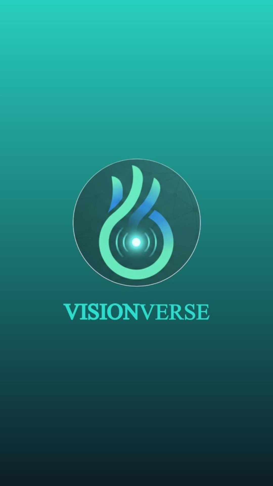
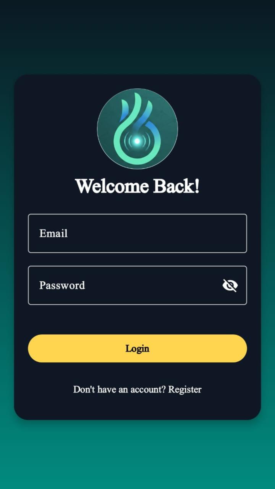
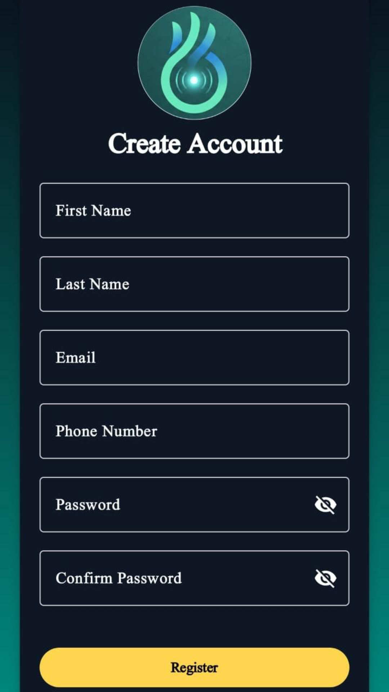
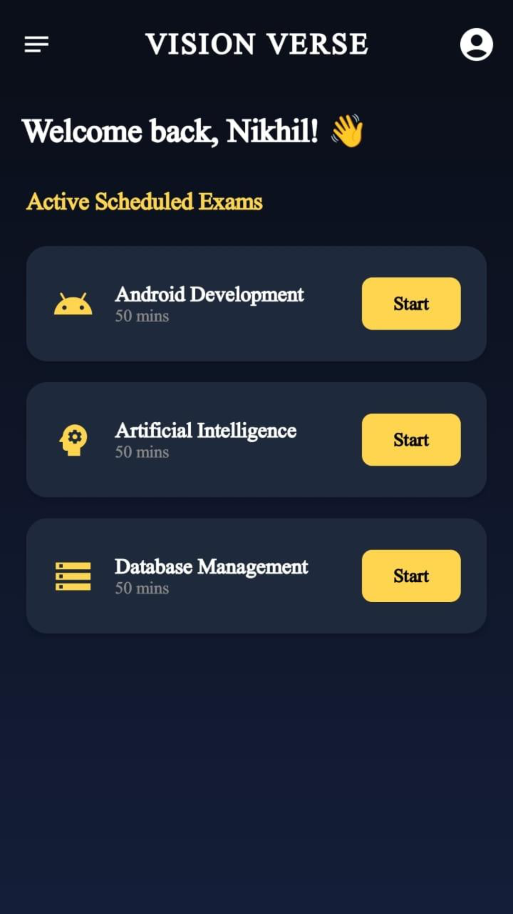
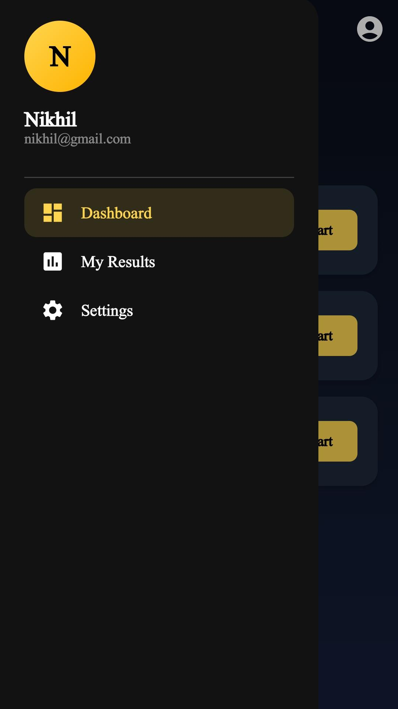
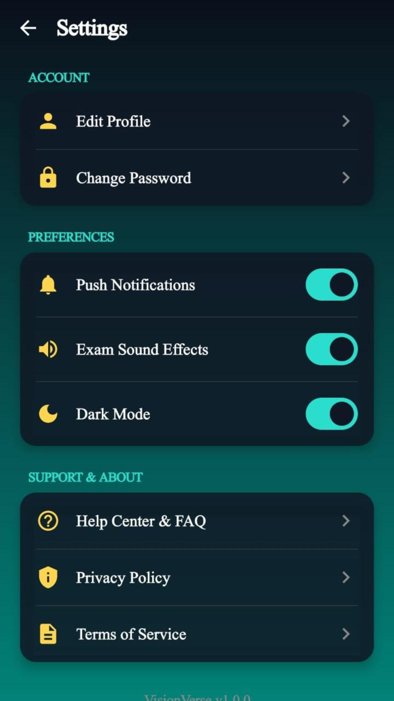
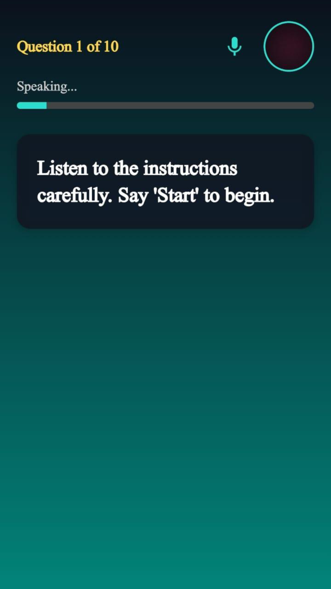
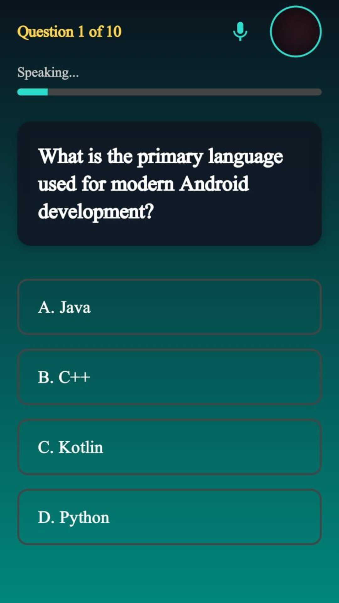

# 🌌 VisionVerse: AI-Powered Examination System

[](https://kotlinlang.org/)
[](https://developer.android.com/jetpack/compose)
[](https://developers.google.com/mediapipe)
[](https://firebase.google.com/)
[](https://opensource.org/licenses/MIT)

**VisionVerse** is a next-generation Android application that transforms the traditional exam experience into a hands-free, AI-driven interaction. By merging **Jetpack Compose** with **Google MediaPipe AI**, it creates a gesture-controlled and voice-activated examination environment designed for accessibility, safety, and integrity.

---

## 📱 App Preview

<p align="center">
  
  
</p>

<p align="center">
  
  
</p>

<p align="center">
  
  
</p>

<p align="center">
  
  
</p>

---

## ✨ Key Features

### 🤖 AI Gesture Recognition
Powered by **MediaPipe Hand Landmarker**, the app detects hand movements in real-time to navigate the exam without touching the screen:
- **Select Option**: Hold up 1, 2, 3, or 4 fingers.
- **Confirm Answer**: 👍 Thumb Up.
- **Cancel Selection**: 👎 Thumb Down.
- **Skip Question**: ✊ Closed Fist.
- **Submit Early**: 🖐️ Open Hand (5 fingers).

### 🎙️ Interactive Voice Control
Full integration with **Speech-to-Text (STT)** and **Text-to-Speech (TTS)**:
- The app reads questions and options aloud for a hands-free experience.
- Responds to voice commands like *"Option A"*, *"Confirm"*, *"Skip"*, or *"Repeat"*.

### 🛡️ Smart Proctoring System
- **App Pinning**: Suggests/Requires Screen Pinning (Lock Task Mode) to prevent exiting.
- **Background Detection**: Automatically monitors if the user tries to leave the app.
- **Three-Strike Policy**: Users get 3 warnings before the exam is automatically submitted to prevent cheating.

### 📊 Comprehensive Dashboard
- **Subject Categories**: Android Development, AI, and Database Management.
- **Progress Tracking**: View detailed results and scores after each exam.
- **Firebase Sync**: Real-time user data and exam records stored securely in **Cloud Firestore**.

---

## 🎮 How to Interact

| Action | ✋ Hand Gesture | 🗣️ Voice Command |
| :--- | :--- | :--- |
| **Select Option** | 1, 2, 3, or 4 Fingers | "Option A", "Option B", etc. |
| **Confirm** | 👍 Thumb Up | "Yes" or "Confirm" |
| **Cancel** | 👎 Thumb Down | "No" or "Cancel" |
| **Skip** | ✊ Closed Fist | "Skip" |
| **Submit Early** | 🖐️ Open Hand | "Submit" |
| **Start Exam** | - | "Start" |

---

## 🛠️ Tech Stack

- **UI Framework**: Jetpack Compose (Material 3)
- **Programming Language**: Kotlin
- **AI/ML**: Google MediaPipe (Vision tasks)
- **Backend**: Firebase Authentication & Cloud Firestore
- **Camera**: CameraX for real-time video processing
- **Audio**: Android Speech API (STT/TTS)
- **Architecture**: MVVM with StateFlow and Coroutines

---

## 🚀 Getting Started

### 1. Clone the Project
```bash
git clone https://github.com/21ashutosh/VisionVerse-App.git
```

### 2. Firebase Setup
1. Go to the [Firebase Console](https://console.firebase.google.com/).
2. Create a new project named **VisionVerse**.
3. Enable **Email/Password Authentication** in the Auth section.
4. Create a **Cloud Firestore** database.
5. Register your Android app and download `google-services.json`.
6. Place `google-services.json` in the `app/` directory.

### 3. Add AI Model Assets
Ensure the `hand_landmarker.task` model file is present in:
`app/src/main/assets/hand_landmarker.task`

### 4. Build & Run
- Open in Android Studio (Ladybug or newer).
- Sync Gradle and run on a physical device for the best AI and Camera performance.

---

## 📄 License
This project is licensed under the **MIT License**.

```text
MIT License

Copyright (c) 2024 ASHUTOSH PAROUHA

Permission is hereby granted, free of charge, to any person obtaining a copy
of this software and associated documentation files (the "Software"), to deal
in the Software without restriction, including without limitation the rights
to use, copy, modify, merge, publish, distribute, sublicense, and/or sell
copies of the Software, and to permit persons to whom the Software is
furnished to do so, subject to the following conditions:

The above copyright notice and this permission notice shall be included in all
copies or substantial portions of the Software.

THE SOFTWARE IS PROVIDED "AS IS", WITHOUT WARRANTY OF ANY KIND, EXPRESS OR
IMPLIED, INCLUDING BUT NOT LIMITED TO THE WARRANTIES OF MERCHANTABILITY,
FITNESS FOR A PARTICULAR PURPOSE AND NONINFRINGEMENT. IN NO EVENT SHALL THE
AUTHORS OR COPYRIGHT HOLDERS BE LIABLE FOR ANY CLAIM, DAMAGES OR OTHER
LIABILITY, WHETHER IN AN ACTION OF CONTRACT, TORT OR OTHERWISE, ARISING FROM,
OUT OF OR IN CONNECTION WITH THE SOFTWARE OR THE USE OR OTHER DEALINGS IN THE
SOFTWARE.
```

---

## 👨‍💻 Developer
**ASHUTOSH PAROUHA**  
*Visionary Android Developer*  
[LinkedIn](https://linkedin.com/in/ashuparouha) | [GitHub](https://github.com/21ashutosh)
